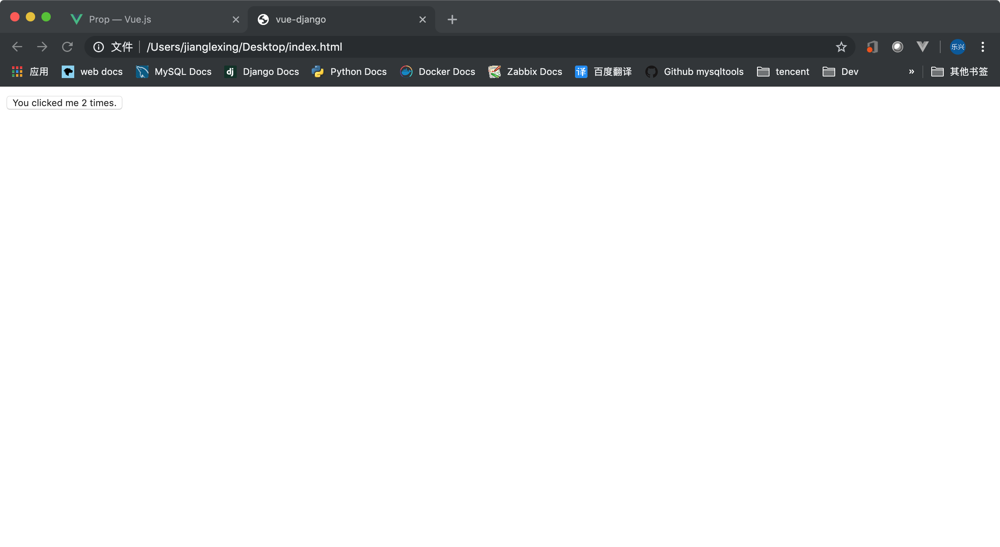
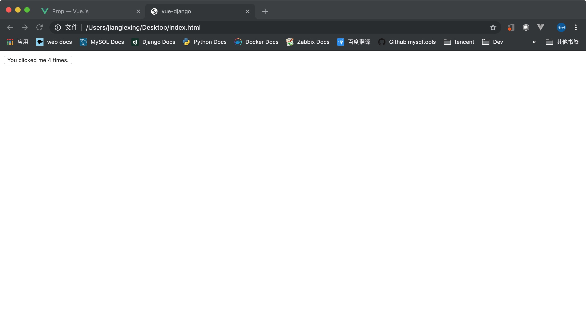
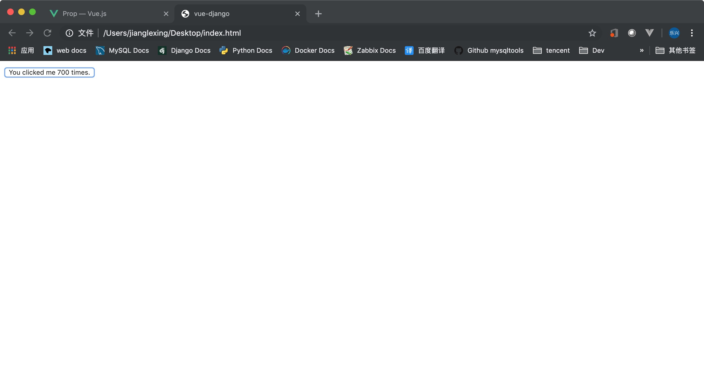

## 目录
- [prop大小写](#prop大小写)
- [prop类型](#prop类型)
- [单向数据流](#单向数据流)

---

## prop大小写
   **HTML 中的特性名是大小写不敏感的，所以浏览器会把所有大写字符解释为小写字符。这意味着当你使用 DOM 中的模板时，camelCase (驼峰命名法) 的 prop 名需要使用其等价的 kebab-case (短横线分隔命名) 命名**
   ```html
    <body>
        <div id="app">
            <button-counter v-bind:int-counter=2></button-counter>
        </div>

        <script>
            Vue.component('button-counter',{
                data: function(){
                    return {
                        intCounter: 0
                    }
                },
                methods: {
                    fun_count: function(){
                        this.intCounter = this.intCounter + 1;
                    },
                },
                props: ['intCounter'],
                template: '<button v-on:click="fun_count">You clicked me {{ intCounter }} times.</button>'
            })

            var app = new Vue({
                el: '#app'
            })
        </script>
    </body>
   ```
   

   总的来说就是在组件声明的时候可以用“驼峰”，在父组件中要用“短横线分隔命名”。

   ---


## prop类型
   **之前的 prop 都是通过列表来指定的，如果想要明确 prop 属性的类型，列表是做不到的。还好 Vue 提供了另一个形式。**
   ```html
    <body>
        <div id="app">
            <button-counter v-bind:int-counter=2></button-counter>
        </div>

        <script>
            Vue.component('button-counter',{
                data: function(){
                    return {
                        intCounter: 0
                    }
                },
                methods: {
                    fun_count: function(){
                        this.intCounter = this.intCounter + 1;
                    },
                },
                props: {
                    intCounter: Number, // 用对象的形式就可以指定 prop 的类型了
                },
                template: '<button v-on:click="fun_count">You clicked me {{ intCounter }} times.</button>'
            })

            var app = new Vue({
                el: '#app'
            })
        </script>
    </body>
   ```
   

   ---

## 单向数据流
   **所有的 prop 都使得其父子 prop 之间形成了一个单向下行绑定：父级 prop 的更新会向下流动到子组件中，但是反过来则不行。这样会防止从子组件意外改变父级组件的状态，从而导致你的应用的数据流向难以理解。**

   **额外的，每次父级组件发生更新时，子组件中所有的 prop 都将会刷新为最新的值。这意味着你不应该在一个子组件内部改变 prop。如果你这样做了，Vue 会在浏览器的控制台中发出警告。**

   **1、** 这个 prop 用来传递一个初始值；这个子组件接下来希望将其作为一个本地的 prop 数据来使用。在这种情况下，最好定义一个本地的 data 属性并将这个 prop 用作其初始值
   ```html
    <body>
        <div id="app">
            <!--模板中通过 counter 来传递值 -->
            <button-counter v-bind:counter=2></button-counter>
        </div>

        <script>
            Vue.component('button-counter',{
                data: function(){
                    return {
                        // 如果想把通过 prop 传过来的值作为初始值
                        // 那么就要自定义一个新的数据项来保存它
                        // 这个时候 this 可以引用到模板中传递过来的 counter
                        intCounter: this.counter
                    }
                },
                methods: {
                    fun_count: function(){
                        this.intCounter = this.intCounter + 1;
                    },
                },
                props: {
                    // 注意在构造函数中通过 props 传递来过的是 counter
                    counter: Number, // 用对象的形式就可以指定 prop 的类型了
                },
                template: '<button v-on:click="fun_count">You clicked me {{ intCounter }} times.</button>'
            })

            var app = new Vue({
                el: '#app'
            })
        </script>
    </body>
   ```
   
   ---

   **2、** 这个 prop 以一种原始的值传入且需要进行转换。在这种情况下，最好使用这个 prop 的值来定义一个计算属性
   ```html
    <body>
        <div id="app">
            <!--模板中通过 counter 来传递值 -->
            <button-counter v-bind:counter=2></button-counter>
        </div>

        <script>
            Vue.component('button-counter',{
                data: function(){
                    return {
                        // 如果想把通过 prop 传过来的值作为初始值
                        // 那么就要自定义一个新的数据项来保存它
                        // 这个时候 this 可以引用到模板中传递过来的 counter
                        intCounter: this.counter
                    }
                },
                computed:{
                    i: function(){
                        return this.intCounter * 100;
                    }
                },
                methods: {
                    fun_count: function(){
                        this.intCounter = this.intCounter + 1;
                    },
                },
                props: {
                    // 注意在构造函数中通过 props 传递来过的是 counter
                    counter: Number, // 用对象的形式就可以指定 prop 的类型了
                },
                template: '<button v-on:click="fun_count">You clicked me {{ i }} times.</button>'
            })

            var app = new Vue({
                el: '#app'
            })
        </script>
    </body>
   ```
   

   ---

## Prop验证
   **Vue 给 prop 提供了强大的验证能力**
   ```js
   Vue.component('my-component', {
     props: {
       // 基础的类型检查 (`null` 和 `undefined` 会通过任何类型验证)
       propA: Number,
       // 多个可能的类型
       propB: [String, Number],
       // 必填的字符串
       propC: {
         type: String,
         required: true
       },
       // 带有默认值的数字
       propD: {
         type: Number,
         default: 100
       },
       // 带有默认值的对象
       propE: {
         type: Object,
         // 对象或数组默认值必须从一个工厂函数获取
         default: function () {
           return { message: 'hello' }
         }
       },
       // 自定义验证函数
       propF: {
         validator: function (value) {
           // 这个值必须匹配下列字符串中的一个
           return ['success', 'warning', 'danger'].indexOf(value) !== -1
         }
       }
     }
   })
   ```
