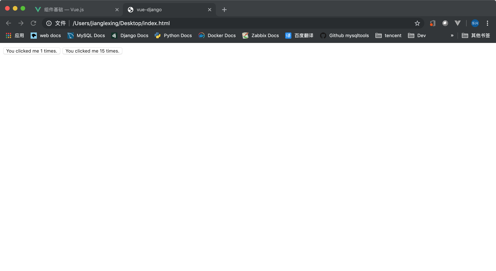
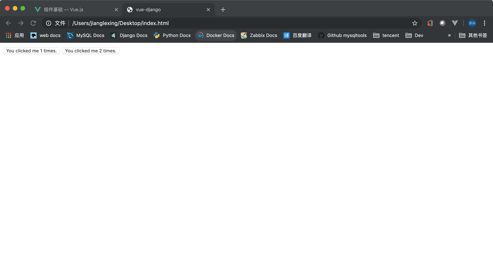

## 目录
- [基本示例](#基本示例)
- [data必须是一个函数](#data必须是一个函数)
- [组件注册](#组件注册)
- [向子组件传递数据](#向子组件传递数据)
- 
---

## 基本示例
   ```html
    <body>
        <div id="app">
            <button-counter></button-counter>
            <button-counter></button-counter>
        </div>

        <script>
            Vue.component('button-counter',{
                data: function(){
                    return {
                        counter: 0
                    }
                },
                methods: {
                    fun_count: function(){
                        this.counter = this.counter + 1;
                    }
                },
                template: '<button v-on:click="fun_count">You clicked me {{ counter }} times.</button>'
            })
            
            var app = new Vue({
                el: '#app'
            })
        </script>
    </body>
   ```
   

   ---

## data必须是一个函数
   **一个组件的 data 选项必须是一个函数，因此每个实例可以维护一份被返回对象的独立的拷贝**

   ---

## 组件注册
   **全局注册**
   ```js
   Vue.component('my-component-name', {
     // ... options ...
   })
   ```
   全局注册的组件可以用在其被注册之后的任何 (通过 new Vue) 新创建的 Vue 根实例，也包括其组件树中的所有子组件的模板中。

   ---

## 向子组件传递数据
   ```html
    <body>
        <div id="app">
            <button-counter v-bind:counter=1></button-counter>
            <button-counter v-bind:counter=2></button-counter>
        </div>

        <script>
            Vue.component('button-counter',{
                data: function(){
                    return {
                        counter: 0
                    }
                },
                methods: {
                    fun_count: function(){
                        this.counter = this.counter + 1;
                    }
                },
                props: ['counter'],
                template: '<button v-on:click="fun_count">You clicked me {{ counter }} times.</button>'
            })

            var app = new Vue({
                el: '#app'
            })
        </script>
    </body>
   ```
   **向子组件传值有两个重点**

   **1、** 子组件要在注册时声明自己支持传哪些值
   ```js
   props: ['counter']
   ```

   **2、** 父组件要在模板中给子组件传入相应的值
   ```html
   <button-counter v-bind:counter="1"></button-counter>
   ```
   

   **3、** 如果子组件中有声明props，但是父组合中并没有传递相应的值，那么对应的值将会是 `NaN`;


