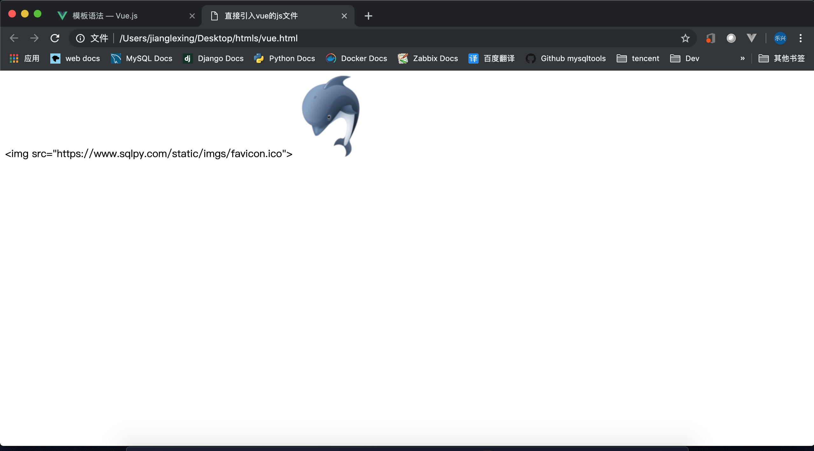
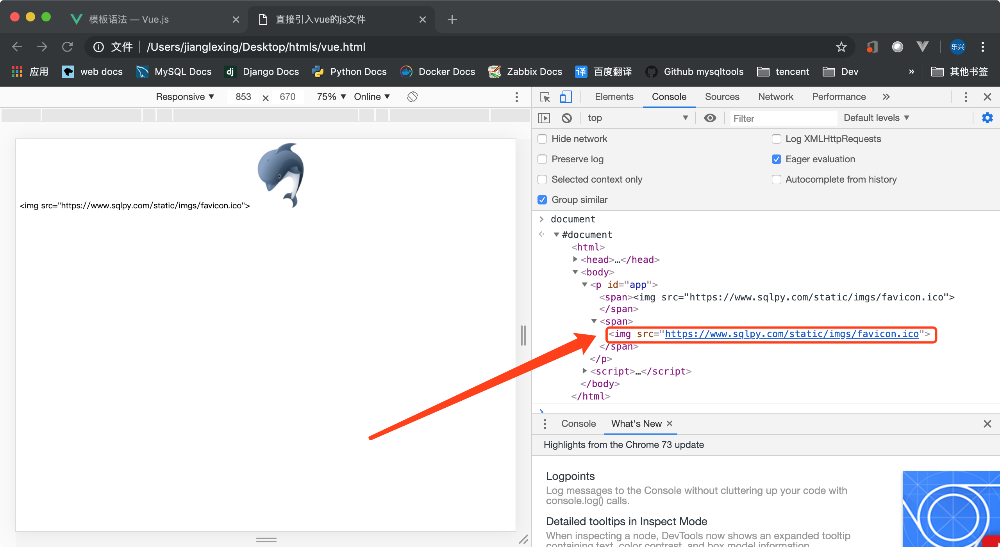

- [模板语法](#模板语法)
- [插值](#插值)
  - [原始HTML](#原始HTML)
  - [属性](#属性)


## 模板语法
   **Vue.js 使用了基于 HTML 的模板语法，允许开发者声明式地将 DOM 绑定至底层 Vue 实例的数据,在底层的实现上，Vue 将模板编译成虚拟 DOM 渲染函数。结合响应系统，Vue 能够智能地计算出最少需要重新渲染多少组件，并把 DOM 操作次数减到最少。**

   ---

## 插值
   **1、双大括号将会被替代为对应数据对象上 msg 属性的值。**
   ```html
   <span>Message: {{ msg }}</span>
   ```
   **2、通过使用 v-once 指令，你也能执行一次性地插值，当数据改变时，插值处的内容不会更新。但请留心这会影响到该节点上的其它数据绑定**
   ```html
   <span v-once>这个将不会改变: {{ msg }}</span>
   ```

   ---

### 原始HTML
   **双大括号会将数据解释为普通文本，而非 HTML 代码。为了输出真正的 HTML，你需要使用 v-html**
   ```html
   <html>
       <head>
           <title>直接引入vue的js文件</title>
           <!-- 开发版没有经过压缩 -->
           <!-- https://vuejs.org/js/vue.js-->
           <script src="https://cdn.jsdelivr.net/npm/vue"></script>
           <meta charset="utf8">
       </head>
   
       <body>
           <p id="app"> 
               <span>{{ message }}</span>
               <span v-html="message"></span>
           </p>
       </body>
   
       <script>
           var app = new Vue({
               'el':'#app',
               data:{
                   message: ''
               }
           });
   
       </script>
   </html>
   ```
   v-html 会直接当成 html 元素给画出来

   

   看一下dom 层面发生了什么

   

   ```html
   <html>
   <head>
        <title>直接引入vue的js文件</title>
        <!-- 开发版没有经过压缩 -->
        <!-- https://vuejs.org/js/vue.js-->
        <script src="https://cdn.jsdelivr.net/npm/vue"></script>
        <meta charset="utf8">
    </head>
   
    <body>
        <p id="app">
            <span>&lt;img src="https://www.sqlpy.com/static/imgs/favicon.ico"&gt;</span> 
            <span></span>
        </p>
   
       <script>
           var app = new Vue({
               'el':'#app',
               data:{
                   message: ''
               }
           });
       </script>
   </body>
   </html>
   ```

   **span 的内容将会被替换成为属性值 rawHtml，直接作为 HTML——会忽略解析属性值中的数据绑定。注意，你不能使用 v-html 来复合局部模板，因为 Vue 不是基于字符串的模板引擎。反之，对于用户界面 (UI)，组件更适合作为可重用和可组合的基本单位**

   ---

### 属性 
   **针对 html 属性没有办法使用双大括号的文本插值，取而代之的是 v-bind 指令**
   ```html
   <html>
       <head>
           <title>直接引入vue的js文件</title>
           <!-- 开发版没有经过压缩 -->
           <!-- https://vuejs.org/js/vue.js-->
           <script src="https://cdn.jsdelivr.net/npm/vue"></script>
           <meta charset="utf8">
       </head>
   
       <body>
           <p id="app"> 
               <span>{{ message }}</span>
               <span v-bind:id="message"></span>
           </p>
       </body>
   
       <script>
           var app = new Vue({
               'el':'#app',
               data:{
                   message: 'hotdb'
               }
           });
   
       </script>
   </html>
   ```
   
   如果属性本身是 boll 值那么会一定的不同

   ```html
   <html>
       <head>
           <title>直接引入vue的js文件</title>
           <script src="https://cdn.jsdelivr.net/npm/vue"></script>
           <meta charset="utf8">
       </head>
   
       <body>
           <p id="app"> 
               <span>{{ message }}</span>
               <!-- 由于 disabled 本身就是代表 boll 值，当这个值本身就是 false 的时候，Vue并不会渲染它-->
               <button v-bind:disabled="message">{{ message }}</button>
           </p>
       </body>
   
       <script>
           var app = new Vue({
               'el':'#app',
               data:{
                   message: false
               }
           });
   
       </script>
   </html>
   ```
   >可以看到渲染后的 button 不包含 disabled
   ```html
   <html>
   <head>
        <title>直接引入vue的js文件</title>
           <script src="https://cdn.jsdelivr.net/npm/vue"></script>
           <meta charset="utf8">
       </head>
   
       <body>
           <p id="app">
                <span>false</span> 
                <button>false</button>
            </p>
       
   
       <script>
           var app = new Vue({
               'el':'#app',
               data:{
                   message: false
               }
           });
   
       </script>
   </body>
   </html>
   ```
   ---

## 缩写
   **由于 v-bind 和 v-on 使用的是如此的广泛，为了少写几个行代码，vue 提供了缩写的能力**
   ```html
   <a v-bind:href="url">...</a>
   <a v-on:click="doSomething">...</a>
   ```
   缩写
   ```html
   <a :href="url">...</a>
   <a @click="doSomething">...</a>
   ```
   >v-bind 直接不用写所以就变成了 :href="href"    v-on 也可以不写所以就成了 :click="doSometing"，但是这样就没能区分是v-bind还是v-on所以把 v-on 缩写后的“:”
   改成了“@”


