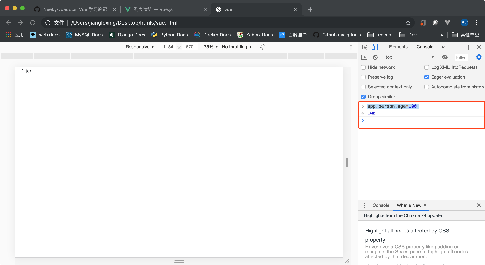
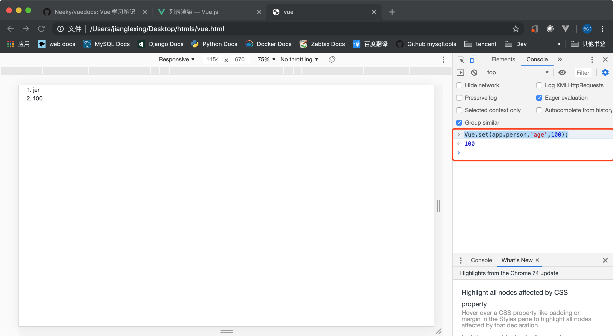
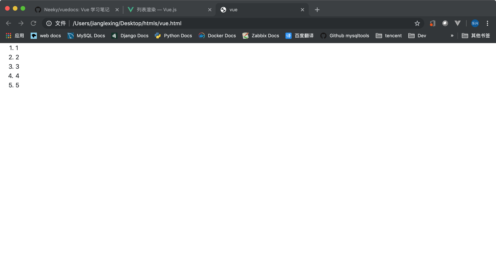
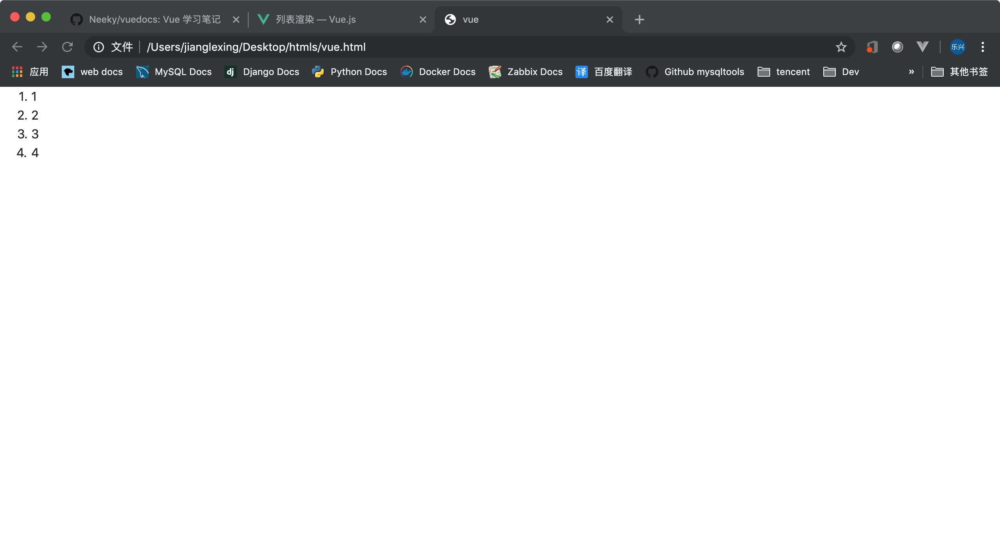
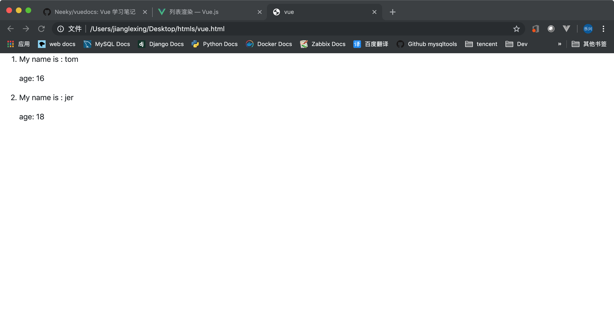

## 目录
  - [列表渲染](#列表渲染)
  - [v-for支持索引](#v-for支持索引)
  - [访问父作用域的属性](#访问父作用域的属性)
  - [遍历对象](#遍历对象)
  - [动态渲染数组](#动态渲染数组)
  - [替换数组](#替换数组)
  - [数组渲染的注意事项](#数组渲染的注意事项)
  - [对象渲染的注意事项](#对象渲染的注意事项)
  - [显示过滤排序后的结果](#显示过滤排序后的结果)
  - [直接使用整数](#直接使用整数)
  - [用template渲染包涵多块的内容](#用template渲染包涵多块的内容)


---

## 列表渲染
   **我们可以用 v-for 指令来渲染一个列表**
   ```html
    <body>
        <div id='app'>
            <ol>
                <li v-for="item in items">
                   {{item.message}}
                </li>
            </ol>
        </div>
        <script>
            var app = new Vue({
                el:'#app',
                data:{
                    items: [{message:"foo"},{message:"bar"}]
                }
            })
        </script>
    </body>
   ```
   >与常规思路不同的是我们要在真正的列表项上加上“v-for”而不是列表项的容器中加上；对应上面的例子就是要在 li 上加而不是在 ol 上加。

   

   ---

## v-for支持索引
   **提供对索引的支持**
   ```html
    <body>
        <div id='app'>
            <ol>
                <li v-for="(item,index) in items">
                   {{item.message}} -- 对应的索引值为：{{ index }}
                </li>
            </ol>
        </div>
        <script>
            var app = new Vue({
                el:'#app',
                data:{
                    items: [{message:"foo"},{message:"bar"}]
                }
            })
        </script>
    </body>
   ```
   

   ---

## 访问父作用域的属性
   ```html
    <body>
        <div id='app'>
            <ol>
                <li v-for="(item,index) in items">
                   {{item.message}} -- {{parentMessage}}
                </li>
            </ol>
        </div>
        <script>
            var app = new Vue({
                el:'#app',
                data:{
                    items: [{message:"foo"},{message:"bar"}],
                    parentMessage: "这是一个父作用域中的属性"
                }
            })
        </script>
    </body>
   ```
   

   ---

## 遍历对象
   ```html
    <body>
        <div id='app'>
            <ol>
                <li v-for="v in king">
                    {{v}}
                </li>
            </ol>
        </div>
        <script>
            var app = new Vue({
                el:'#app',
                data:{
                    king:{
                        name: "拿破仑",
                        birthday: "1769年8月15日生人"
                    }
                }
            })
        </script>
    </body>
   ```
   >对象可迭代属性本来就是可以迭代的，不知道官方文档为什么把迭代对象单独出来

   

   迭代对象的情况下，我们向对象增加新”属性“新加的”属性“不会被动态的渲染在页面上。

   ---

## 动态渲染数组
   ```html
    <body>
        <div id='app'>
            <ol>
                <li v-for="item in items">
                    {{item}}
                </li>
            </ol>
        </div>
        <script>
            var app = new Vue({
                el:'#app',
                data:{
                    items: ['foo','bar']
                }
            });
        </script>
    </body>
   ```

   

   向数组中增加新的数据

   ```js
   app.items.push('json')
   ```

   

   **数组对象的这些方法都是可以动态渲染的**
   ```js
   push()
   pop()
   shift()
   unshift()
   splice()
   sort()
   reverse()
   ```
   ---

## 替换数组
   **更新整个数组对象、列表也会被动态的渲染**
   ```html
    <body>
        <div id='app'>
            <ol>
                <li v-for="item in items">
                    {{item}}
                </li>
            </ol>
        </div>
        <script>
            var app = new Vue({
                el:'#app',
                data:{
                    items: ['foo','bar']
                }
            });
        </script>
    </body>
   ```
   

   更新整个数组

   ```html
   app.items = ['one','two','three'];
   ```
   >注意上面的用法是 app.items 而不是 app.data.items 后者在语法上是不成立的

   

   ---

## 数组渲染的注意事项
   **1、** 索引赋值不是响应式的

   **2、** 直接设置数据库对象的 length 属性也不是响应式的
   ```html
    <body>
        <div id='app'>
            <ol>
                <li v-for="item in items">
                    {{item}}
                </li>
            </ol>
        </div>
        <script>
            var app = new Vue({
                el:'#app',
                data:{
                    items: ['foo','bar']
                }
            });
            // 以下两个操作是无效的
            app.items[0] = 'jer';
            app.items.length = 1;
        </script>
    </body>
   ```
   

   > app.items[0] = 'jer'; 和 app.items.length = 1; 都不是响应式的，所以页面上看不到变化

   **1、** 为了解决第一个问题可以这样来做
   ```js
   // vm.$set(vm.items,itemIndex,newValue);
   app.$set(app.items,0,'jer');

   // Vue.set(app.items,0,'tom'); 
   Vue.set(app.items,0,'tom');

   // 这两个实现方式的效果是一样的,vm.$set 是 Vue.set 的别名
   ```
   

   >Vue.set(app.items,0,'tom'); 后的效果

   **2、** 为了解决第二个问题可以这样
   ```
   vm.items.splice(newLenghth);
   ```
   

   >app.items.splice(1); 执行这个之后数组的长度响应式的设置成了 1 。

   ---

## 对象渲染的注意事项
   **由于 js 的限制，给对象增加(或删除)属性并不是响应式的**
   ```html
    <body>
        <div id='app'>
            <ol>
                <li v-for="v in person">
                    {{v}}
                </li>
            </ol>
        </div>
        <script>
            var app = new Vue({
                el:'#app',
                data:{
                    person: {
                        name: "jer",
                    }
                }
            });
        </script>
    </body>
   ```
   

   ```js
   app.person.age=100;
   ```

   由于 `app.person.age=100` 动态的给对象增加新的属性并不是响应式的，所以页面不会地更新。

   

   要解决上面的问题可以这样做
   ```
   // Vue.set(object, propertyName, value)
   Vue.set(app.person,'age',100);
   ```
   

   实在不行还可以这样

   ```js
   app.person = {'a':100,'b':200};
   ```

   ---

## 显示过滤排序后的结果
   **有时候我们要显示“过滤”，“排序” 后的结果，通常来说使用计算属性就能满足要求**
   ```html
    <body>
        <div id='app'>
            <ol>
                <li v-for="item in top_5">
                    {{item}}
                </li>
            </ol>
        </div>
        <script>
            var app = new Vue({
                el:'#app',
                data:{
                    items: [1,2,3,4,5,6,7,8,9]
                },
                computed:{
                    top_5:function(){
                        return this.items.slice(0,5);
                    }
                }
            });
        </script>
    </body>
   ```
   

   ---

## 直接使用整数
   **在 v-for 中直接使用整数代表迭代 n 次**
   ```html
    <body>
        <div id='app'>
            <ol>
                <li v-for="item in 4">
                    {{item}}
                </li>
            </ol>
        </div>
        <script>
            var app = new Vue({
                el:'#app'
            });
        </script>
    </body>
   ```
   

   ---

## 用template渲染包涵多块的内容
   **如果要渲染的每一项都包涵多块内容，可以用template把他们包起来**
   ```html
    <body>
        <div id='app'>
            <ol>
                <template v-for="p in persons">
                    <li >
                        <p>My name is : {{p.name}}</p>
                        <p>age: {{p.age}}</p>
                    </li>
                </template>
            </ol>
        </div>
        <script>
            var app = new Vue({
                el:'#app',
                data:{
                    persons:[
                        {name:'tom',age:16},
                        {name:'jer',age:18},
                    ]
                }
            });
        </script>
    </body>
   ```
   
   
