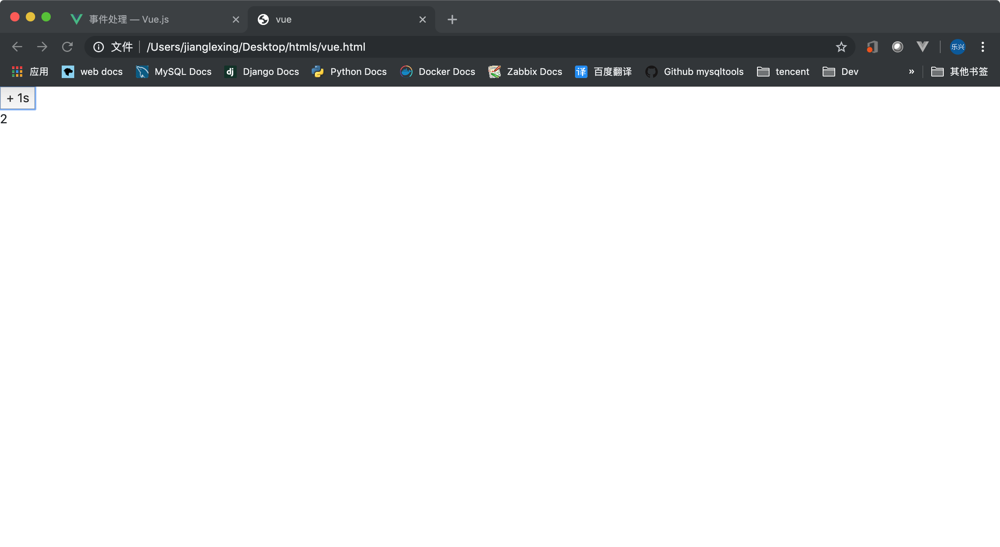
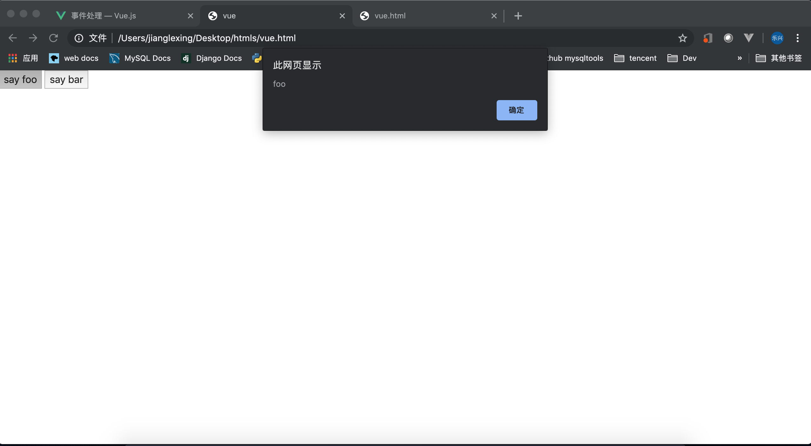
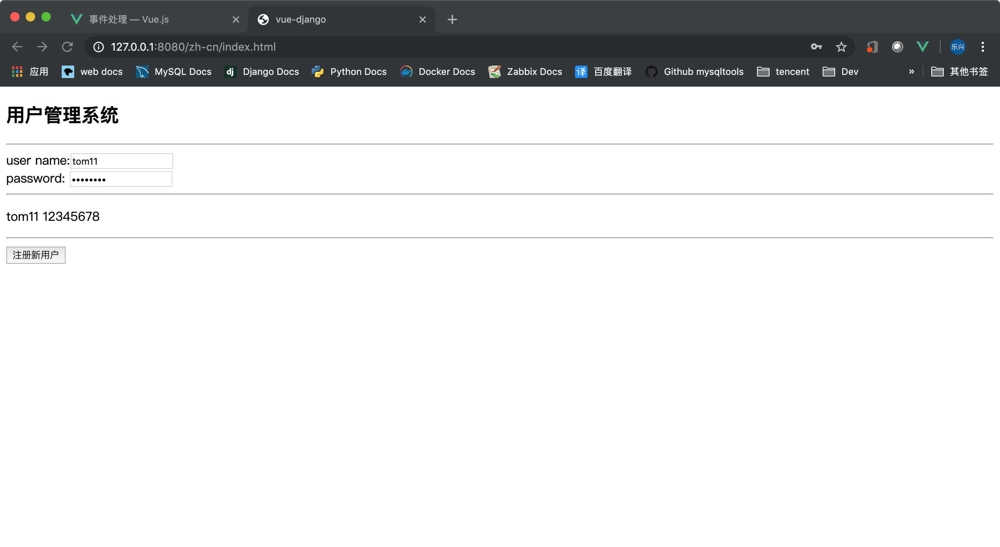

## 目录
- [事件处理](#事件处理)
- [事件处理方法](#事件处理方法)
- [内联处理器中的方法](#内联处理器中的方法)
- [事件修饰符](#事件修饰符)

---

## 事件处理
   **可以用 v-on 指令监听 DOM 事件，并在触发时运行一些 JavaScript 代码。**
   ```html
    <body>
        <div id='app'>
            <button v-on:click="counter = counter + 1"> + 1s </button>
            <p>{{counter}}</p>
        </div>
        <script>
            var app = new Vue({
                el: "#app",
                data: {
                    counter: 0
                }
            });
        </script>
    </body>
   ```
   

   >1、v-on:click 可以直接绑定要运行的 js 代码 2、这个时候的 this 应该是被绑定到了 Vue 实例对象。

   ---

## 事件处理方法
   **许多事件处理逻辑会更为复杂，所以直接把 JavaScript 代码写在 v-on 指令中是不可行的。因此 v-on 还可以接收一个需要调用的方法名称**
   ```html
    <body>
        <div id='app'>
            <button v-on:click="plus_one"> + 1s </button>
            <p>{{counter}}</p>
        </div>
        <script>
            var app = new Vue({
                el: "#app",
                data: {
                    counter: 0
                },
                methods: {
                    plus_one: function(event){
                        // 加 1 操作
                        this.counter = this.counter + 1;
                    }
                }
            });
        </script>
    </body>
   ```
   > event 可以得到触发事件的 dom 元素
   ```html
    <body>
        <div id='app'>
            <button v-on:click="plus_one" name="btn_plus_one"> + 1s </button>
            <p>{{counter}}</p>
        </div>
        <script>
            var app = new Vue({
                el: "#app",
                data: {
                    counter: 0
                },
                methods: {
                    plus_one: function(event){
                        // 加 1 操作
                        this.counter = this.counter + 1;
                        console.log(event); // MouseEvent
                        console.log(event.target.name); // btn_plus_one
                    }
                }
            });
        </script>
    </body>
   ```

   ---

## 内联处理器中的方法
   ```html
    <body>
        <div id='app'>
            <button v-on:click="say('foo')" name="btn_say_foo"> say foo</button>
            <button v-on:click="say('bar')" name="btn_say_bar"> say bar</button>
        </div>
        <script>
            var app = new Vue({
                el: "#app",
                methods: {
                    say: function(message){
                        alert(message);
                        console.log(arguments.length); // 1 因为 v-on:click 只传了一个参数
                    }
                }
            });
        </script>
    </body>
   ```
   

   需要在内联语句处理器中访问原始的 DOM 事件。可以用特殊变量 $event 把它传入方法

   ```html
    <body>
        <div id='app'>
            <!-- 在模板中通过 $event 把事件传进去 -->
            <button v-on:click="say('foo',$event)" name="btn_say_foo"> say foo</button>
            <button v-on:click="say('bar',$event)" name="btn_say_bar"> say bar</button>
        </div>
        <script>
            var app = new Vue({
                el: "#app",
                methods: {
                    // 定义的时候定义成支持两个参数的形式
                    say: function(message,event){
                        alert(message);
                        alert(event);
                        console.log(arguments.length); // 1 因为 v-on:click 只传了一个参数
                    }
                }
            });
        </script>
    </body>
   ```

   ---

## 事件修饰符
   **在事件处理程序中调用 event.preventDefault() 或 event.stopPropagation() 是非常常见的需求。尽管我们可以在方法中轻松实现这点，但更好的方式是：方法只有纯粹的数据逻辑，而不是去处理 DOM 事件细节。**

   **为了解决这个问题，Vue.js 为 v-on 提供了事件修饰符。之前提过，修饰符是由点开头的指令后缀来表示的。**

   ```html
   <!-- 阻止单击事件继续传播 -->
   <a v-on:click.stop="doThis"></a>
   
   <!-- 提交事件不再重载页面 -->
   <form v-on:submit.prevent="onSubmit"></form>
   
   <!-- 修饰符可以串联 -->
   <a v-on:click.stop.prevent="doThat"></a>
   
   <!-- 只有修饰符 -->
   <form v-on:submit.prevent></form>
   
   <!-- 添加事件监听器时使用事件捕获模式 -->
   <!-- 即元素自身触发的事件先在此处理，然后才交由内部元素进行处理 -->
   <div v-on:click.capture="doThis">...</div>
   
   <!-- 只当在 event.target 是当前元素自身时触发处理函数 -->
   <!-- 即事件不是从内部元素触发的 -->
   <div v-on:click.self="doThat">...</div>

   <!-- 点击事件将只会触发一次 -->
   <a v-on:click.once="doThis"></a>

   <!-- 滚动事件的默认行为 (即滚动行为) 将会立即触发 -->
   <!-- 而不会等待 `onScroll` 完成  -->
   <!-- 这其中包含 `event.preventDefault()` 的情况 -->
   <div v-on:scroll.passive="onScroll">...</div>
   ```

   **例子：** 注册新用户的按钮只能按一次
   ```html
    <body>
        <div id="app">
            <h2>用户管理系统</h2>
            <hr>
            <div>
                <label>user name:</label><input name="user_name" type="text" v-model="user_name">
            </div>
            <div>
                <label>password: </label><input name="password" type="password" v-model="password">
            </div>
            <hr>
            <p>{{user_name}}  {{password}}</p>
            <hr>
            <button v-on:click.once="create_user">注册新用户</button>
        </div>
        <script>
            var app = new Vue({
                el: '#app',
                data: {
                    user_name: "tom",
                    password: '12345678',
                },
                methods:{
                    create_user: function(){
                        axios.post('/um/users/create/',{user_name: this.user_name,password: this.password},{
                            xsrfCookieName: 'csrftoken',
                            xsrfHeaderName: 'X-CSRFToken',
                            headers: {
                                'Content-Type': 'application/x-www-form-urlencoded'
                            },
                            transformRequest: [function(data,headers) {
                                // 把要提交的数据编码一下 k1=v1&k2=v2
                                let res = ''
                                for(let k in data) {
                                    res += encodeURIComponent(k) + '=' + encodeURIComponent(data[k]) + '&'
                                }
                                return res
                            }]
                        }).then(function(response){
                            alert(response.data.message);
                        })
                    }
                }
            })
        </script>
    </body>
   ```
   

   ---


