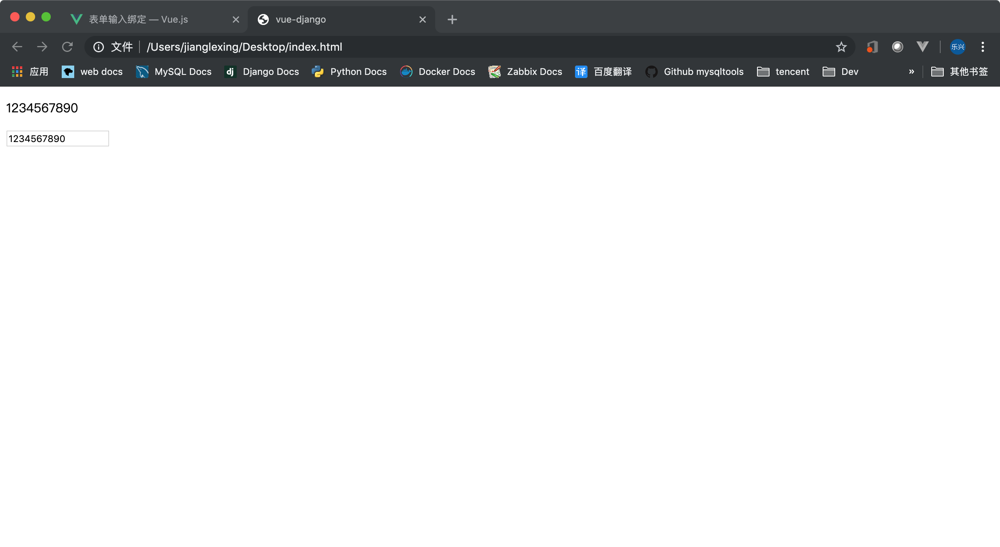
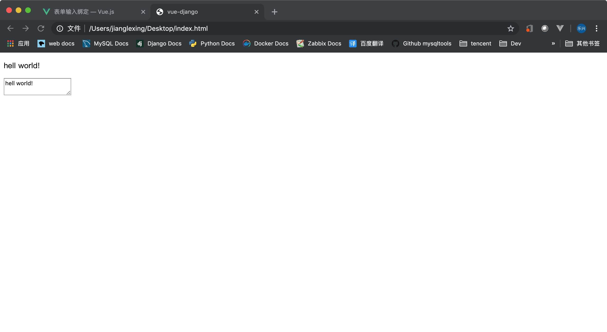
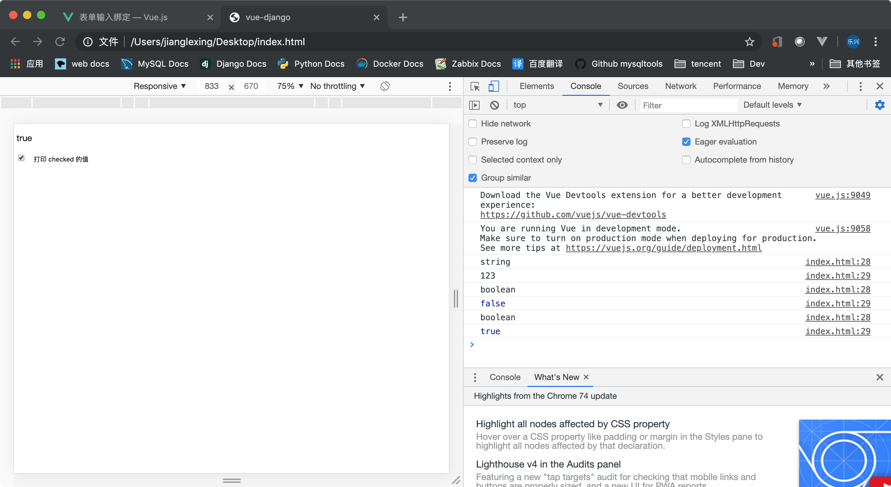
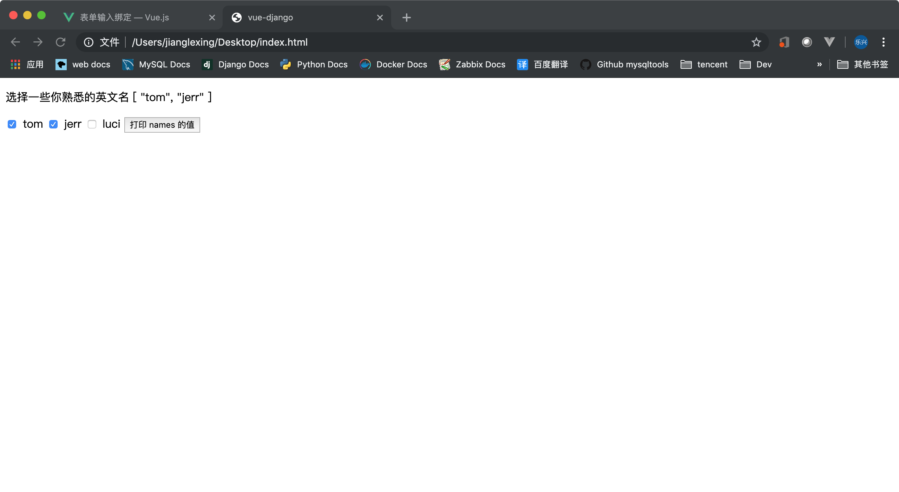
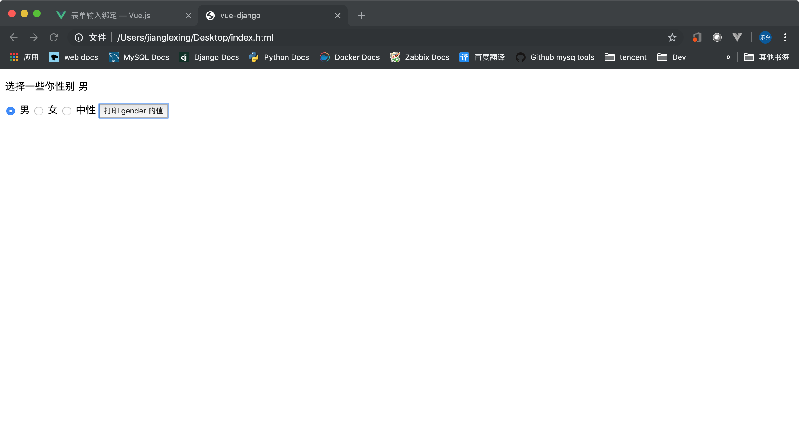
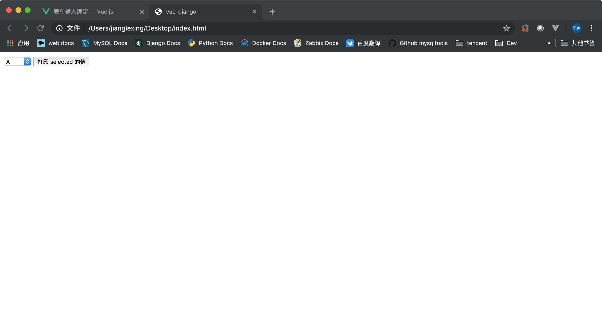
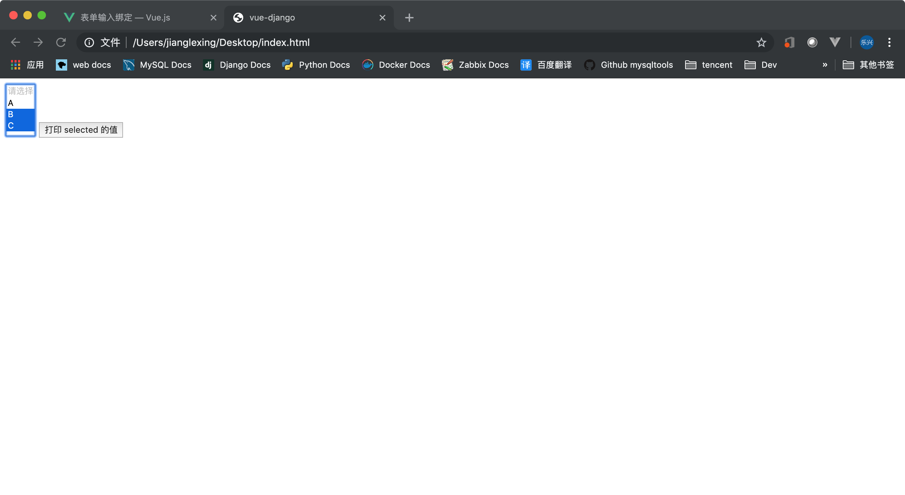

## 目录
- [基础用法](#基础用法)
- [文本](#文本)
- [多行文本](#多行文本)
- [复选框](#复选框)
- [多个复选框绑定到同一个数组](#多个复选框绑定到同一个数组)
- [单选按钮](#单选按钮)
- [选择框](#选择框)
---

## 基础用法
   **你可以用 v-model 指令在表单 \<input\>、\<textarea\> 及 \<select\> 元素上创建双向数据绑定。它会根据控件类型自动选取正确的方法来更新元素。尽管有些神奇，但 v-model 本质上不过是语法糖。它负责监听用户的输入事件以更新数据，并对一些极端场景进行一些特殊处理。**

   **v-model 会忽略所有表单元素的 value、checked、selected 特性的初始值而总是将 Vue 实例的数据作为数据来源。你应该通过 JavaScript 在组件的 data 选项中声明初始值。**

   ---

## 文本
   **input 中的内容同步显示到 p 标签中**
   ```html
    <body>
        <div id="app">
            <p>{{user_name}}</p>
            <input name="user_name" v-model="user_name">
        </div>

        <script>
            var app = new Vue({
                el: '#app',
                data: {
                    user_name: ''
                }
            })
        </script>
    </body>
   ```
   

   ---

## 多行文本
   ```html
    <body>
        <div id="app">
            <p>{{user_name}}</p>
            <textarea v-model="user_name"></textarea>
        </div>

        <script>
            var app = new Vue({
                el: '#app',
                data: {
                    user_name: ''
                }
            })
        </script>
    </body>
   ```
   

   ---

## 复选框
   ```html
    <body>
        <div id="app">
            <p>{{checked}}</p>
            <input type="checkbox" v-model="checked">
            <button v-on:click="show_checked_value">打印 checked 的值</button>
        </div>

        <script>
            var app = new Vue({
                el: '#app',
                data: {
                    checked: '123'
                },
                methods:{
                    show_checked_value : function(){
                        console.log(typeof(this.checked));
                        console.log(this.checked);
                    }
                }
            })
        </script>
    </body>
   ```
   

   >给复选框绑定的值可以是任何类型，比如说上面我就给它绑定了一个'123'，由于复选框它默认的值是 true,false 所以最好还是绑定这两个
   boolean 类型的值比较好。

   ---

## 多个复选框绑定到同一个数组
   ```html
    <body>
        <div id="app">
            <p>选择一些你熟悉的英文名 {{names}}</p>
            <input type="checkbox" id="tom" v-model="names" value="tom">
            <label for="tom">tom</label>

            <input type="checkbox" id="jerr" v-model="names" value="jerr">
            <label for="jerr">jerr</label>

            <input type="checkbox" id="luci" v-model="names" value="luci">
            <label for="luci">luci</label>            
            <button v-on:click="show_names_value">打印 names 的值</button>
        </div>

        <script>
            var app = new Vue({
                el: '#app',
                data: {
                    names: []
                },
                methods:{
                    show_names_value : function(){
                        console.log(typeof(this.names));
                        console.log(this.names);
                    }
                }
            })
        </script>
    </body>
   ```
   

   ---

## 单选按钮
   ```html
    <body>
        <div id="app">
            <p>选择一些你性别 {{gender}}</p>
            <input type="radio" name="gender" id="man" v-model="gender" value="男">
            <label for="man">男</label>

            <input type="radio" name="gender"  id="woman" v-model="gender" value="女">
            <label for="woman">女</label>

            <input type="radio" name="gender"  id="common" v-model="gender" value="中性">
            <label for="common">中性</label>            
            <button v-on:click="show_gender_value">打印 gender 的值</button>
        </div>

        <script>
            var app = new Vue({
                el: '#app',
                data: {
                    gender: '男'
                },
                methods:{
                    show_gender_value : function(){
                        console.log(typeof(this.gender));
                        console.log(this.gender);
                    }
                }
            })
        </script>
    </body>
   ```
   

   ---

## 选择框
   ```html
    <body>
        <div id="app">
            <select v-model="selected">
                <option disabled value="">请选择</option>
                <option value="1">A</option>
                <option value="2">B</option>
                <option value="3">C</option>
            </select>       
            <button v-on:click="show_selected_value">打印 selected 的值</button>
        </div>

        <script>
            var app = new Vue({
                el: '#app',
                data: {
                    selected: ''
                },
                methods:{
                    show_selected_value : function(){
                        console.log(typeof(this.selected));
                        console.log(this.selected);
                    }
                }
            })
        </script>
    </body>
   ```
   

   **复选**

   ```html
    <body>
        <div id="app">
            <select v-model="selected" multiple>
                <option disabled value="">请选择</option>
                <option value="1">A</option>
                <option value="2">B</option>
                <option value="3">C</option>
            </select>       
            <button v-on:click="show_selected_value">打印 selected 的值</button>
        </div>

        <script>
            var app = new Vue({
                el: '#app',
                data: {
                    selected: []
                },
                methods:{
                    show_selected_value : function(){
                        console.log(typeof(this.selected));
                        console.log(this.selected);
                    }
                }
            })
        </script>
    </body>
   ```
   
   


